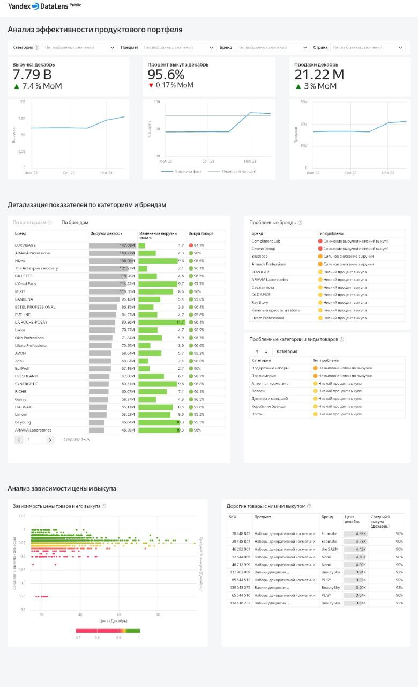

# Анализ эффективности продуктового портфеля

## Дашборд
[Открыть в DataLens](https://datalens.yandex/jo1copviw13o4)

## О проекте
Дашборд для управления ассортиментом брендов и анализа ключевых метрик в сфере розничной продажи косметики. Создан для команды продукта и ежемесячных встреч с руководством.

## Бизнес-задачи
- **Мониторинг динамики** ключевых метрик (выручка, продажи, выкуп) месяц к месяцу
- **Управление ассортиментом** брендов и продуктов
- **Анализ эффективности** текущего ассортимента  
- **Выявление непопулярных продуктов** для оптимизации
- **Поддержка принятия решений** по привлечению новых брендов
- **Обеспечение роста** выручки на 5%+ и достижение 95%+ процента выкупа

## Логика аналитических блоков

### KPI с динамикой
- **Выручка, продажи, выкуп** — ключевые метрики согласно задаче
- **Динамика за 6 месяцев** — отслеживание трендов  
- **Сравнение с планом** — рост 5% в месяц к месяцу для выручки, 95% для выкупа

### Детализация по категориям и брендам
- **Иерархия анализа** — от общего к частному
- **Цветовая индикация** — быстрое выявление отклонений от плана
- **Две отдельные вкладки** — разные бизнес-оси (категории ≠ бренды)

### Проблемные зоны
- **Типизация проблем** — разные цвета для разных проблем
- **Готовый список для оперативного реагирования** — фокус на значимых проблемах

### Анализ дорогих товаров
- **График зависимости (от 1,500₽)** — визуализация связи цены и выкупа
- **Таблица дорогих товаров (от 3,500₽)** — кандидаты для скидок и акций

## Принципы приоритизации проблем

**В проблемные зоны попадают бренды/товары, которые:**
- Имеют значительный объём выручки
- Показывают критическое падение показателей  
- Являются дорогими товарами (> 3,500₽) с низким выкупом

*Пример: бренд с выручкой 0,16 млн и выкупом 75% не попадает в проблемные — несмотря на низкий выкуп, его финансовое влияние на бизнес минимально.*

## Бизнес-результаты
*На основе анализа данных за декабрь 2023:*
- **Оперативная аналитика** — ключевые метрики доступны в режиме реального времени
- **Выявление проблем** — 11 проблемных брендов, 7 категорий и 50+ товаров с отклонениями от плана
- **Кандидаты на оптимизацию** — 10 дорогих товаров с низким выкупом для ценовых корректировок
- **Автоматизация отчётности** — исключение ручного сбора данных для ежемесячных отчётов

## Технические решения
- **Оптимизация производительности** через фильтрацию данных в ключевых блоках
- **Приоритизация данных** для отображения наиболее значимых показателей
- **Баланс между скоростью и полнотой** аналитики
- **Интеграция внешних данных** — динамика за полгода подключена из отдельного датасета

## Скриншот 

